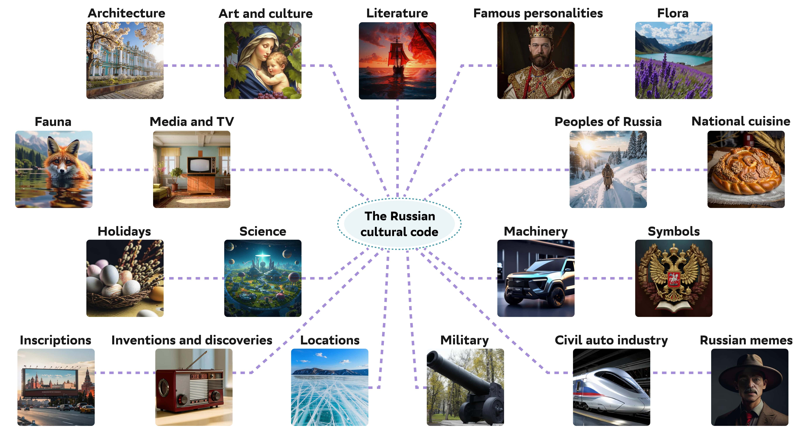
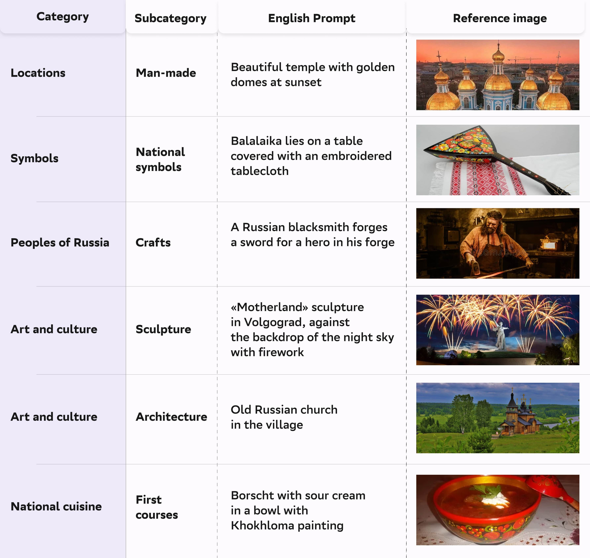
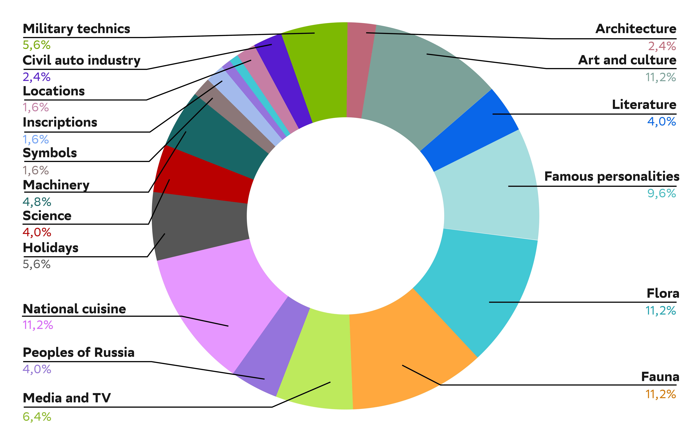

# RusCode: Russian Cultural Code Benchmark for Text-to-Image Generation
Official repository for RusCode benchmark dataset (NAACL 2025)

Text-to-image generation models have gained popularity among users around the world. However, many of these models exhibit a strong bias toward English-speaking cultures, ignoring or misrepresenting the unique characteristics of other language groups, countries, and nationalities. The lack of cultural awareness can reduce the generation quality and lead to undesirable consequences such as unintentional insult, and the spread of prejudice. In contrast to the field of natural language processing, cultural awareness in computer vision has not been explored as extensively. 

We propose a RusCode benchmark for evaluating the quality of text-to-image generation containing elements of the Russian cultural code. To do this, we form a list of 19 categories that best represent the features of Russian visual culture. Our final dataset consists of 1250 text prompts in Russian and their translations into English. The prompts cover a wide range of topics, including complex concepts from art, popular culture, folk traditions, famous people's names, natural objects, scientific achievements, etc.

## Categories

## References

## Statistic
The ratio of the number of collected prompts by each category in the RusCode dataset

### Citation
You can cite the paper using the following BibTeX entry:
    
    @misc{vasilev2025ruscoderussianculturalcode,
      title={RusCode: Russian Cultural Code Benchmark for Text-to-Image Generation}, 
      author={Viacheslav Vasilev and Julia Agafonova and Nikolai Gerasimenko and Alexander Kapitanov and Polina Mikhailova and Evelina Mironova and Denis Dimitrov},
      year={2025},
      eprint={2502.07455},
      archivePrefix={arXiv},
      primaryClass={cs.CV},
      url={https://arxiv.org/abs/2502.07455}, 
    }

